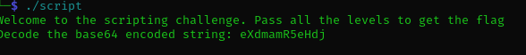
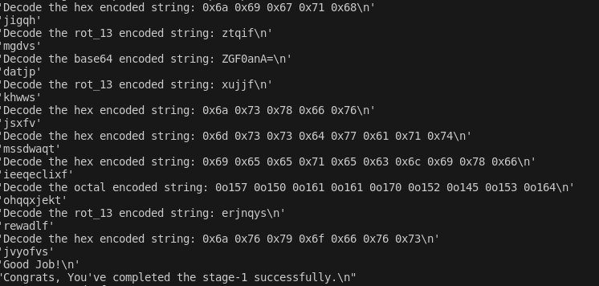
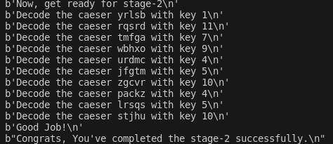
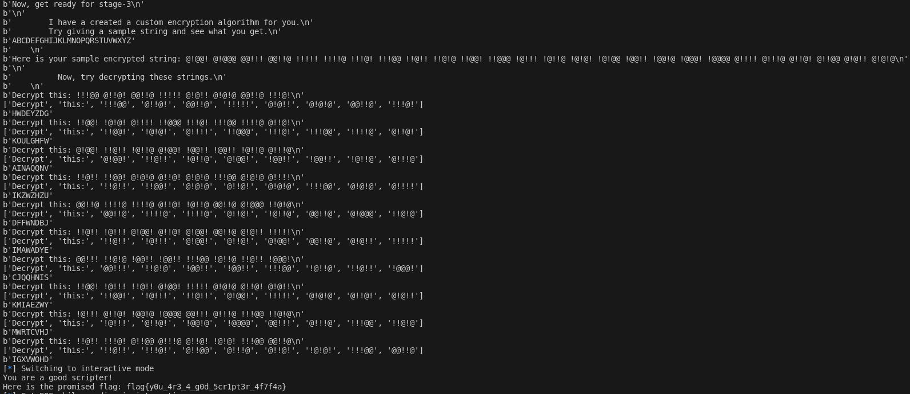

# Challenge 2
## Challenge Description
```
I found this weird game where it runs only for few seconds but it holds the greatest treasure. 

Tip: Automate your steps using Pwntools for extra advantage or else you will be doomed !
```

## <span style="color:aqua;">Analysis</span>
 We were given a file name script which required " chmod " for executing. <br> Then we were given a scripting challenge to capture the flag by decoding a series of problems. 
   
### Phase one
 From the challenge description it is clear that withput using pwntools the challenge is very difficult so i made a md file which executes the file. Then I figured out the pattern of the question for phase 1 where we have to decode the string from different encryption methods like base64 , rot-13 , hex , etc<br>
 I made a code where it identifies the encryption type which is always the third word and the strings which is the last word. It then passes that into a funtion and finally decodes the answer.



### Phase two
Similarly in stage two were were given a caser encoded string and caeser key. I did the same thing as the above program and completed the stage.



### Phase three
Phase three was different than the other two here we were given a custom encryption algorithm for any strings. So I entered all the alphabets from A to Z and added the encrypted strings into a dictionary and used the dictionary to decode the algorithm.


## <span style="color:Green;">Flag- flag{y0u_4r3_4_g0d_5cr1pt3r_4f7f4a}</span>