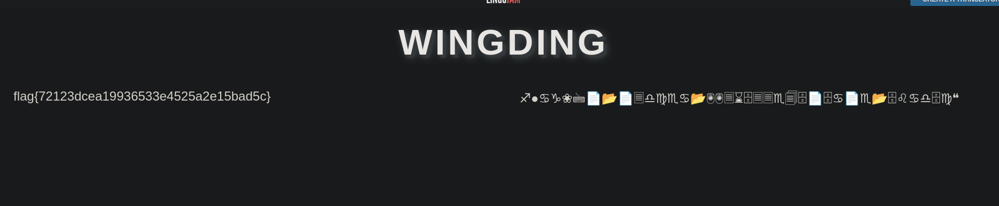

# Challenge 3
## Challenge Description
```
My friend sent me this weird text. I am not sure whether this is an SOS message or if he is trolling me.  Help me decode this.
```
## <span style="color:aqua;">Analysis</span>
In this challenge there was a data.txt file given which includes a series of emojis.At first glace the first letter of each emoji was giving a meaningful output but it was not close to the required flag format which was **flag{.*}** so after messing around it for days I googled the emoji and found a encryption method using emoji called **WINGDING** so i translated the emojis and found out the flag!


## <span style="color:Green;">Flag - f︎l︎a︎g︎{︎7︎2︎1︎2︎3︎d︎c︎e︎a︎1︎9︎9︎3︎6︎5︎3︎3︎e︎4︎5︎2︎5︎a︎2︎e︎1︎5︎b︎a︎d︎5︎c︎}︎</span>